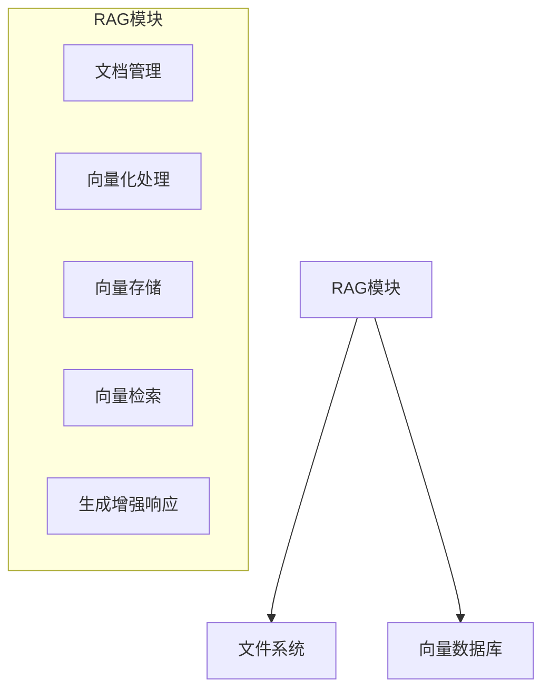
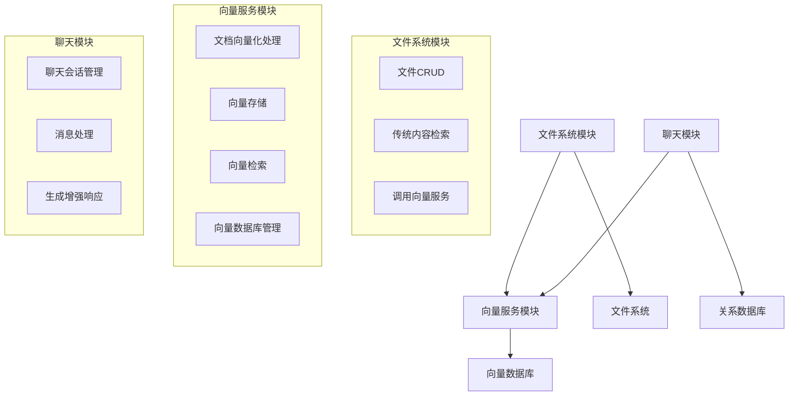
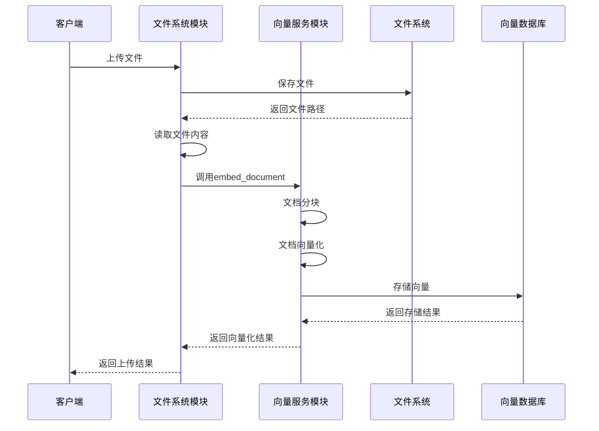
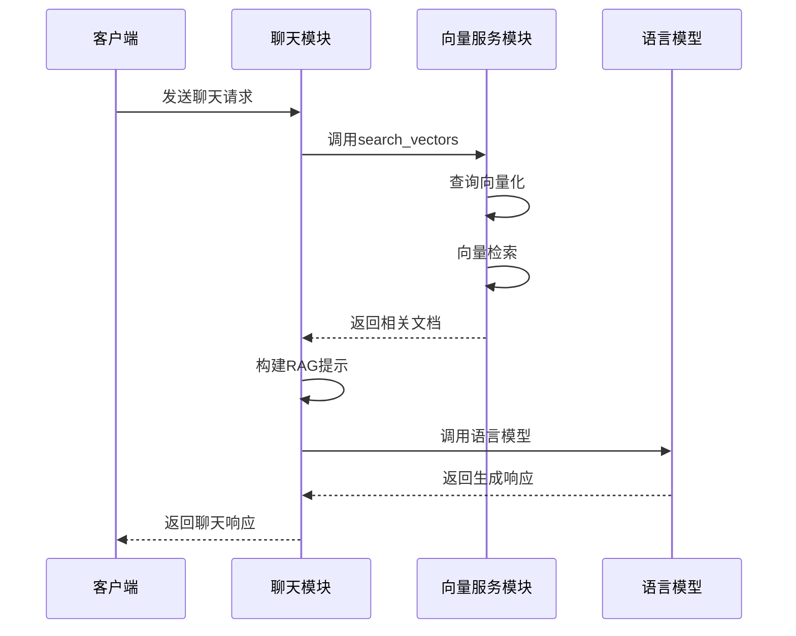

# RAG架构优化方案

## 1. 优化背景

当前RAG架构将**文档管理**、**向量化处理**、**向量存储**、**向量检索**和**生成增强响应**等不同职责的功能整合在一个模块中，导致：
- 模块职责不清晰，难以维护
- 功能耦合度高，难以独立扩展
- 代码量过大，开发和调试困难
- 性能瓶颈难以定位和优化

为了提高系统的**模块化程度**、**可维护性**和**可扩展性**，需要对RAG架构进行优化。

## 2. 优化目标

| 目标 | 详细描述 |
|------|----------|
| **提高模块化程度** | 将不同功能拆分为独立模块，各模块职责单一 |
| **明确职责划分** | 各模块有清晰的职责边界，避免职责重叠 |
| **降低耦合度** | 模块间通过明确的接口通信，避免直接依赖 |
| **提高可扩展性** | 便于独立扩展各模块功能，支持新功能的快速添加 |
| **优化性能** | 避免不必要的通讯开销，提高系统响应速度 |
| **提高可测试性** | 各模块可以独立测试，便于定位和修复问题 |

## 3. 优化前后架构对比

### 3.1 优化前架构



### 3.2 优化后架构



## 4. 各模块详细设计

### 4.1 文件系统模块

#### 核心职责
- **文件CRUD操作**：上传、下载、更新、删除文件
- **传统内容检索**：基于关键词的文件内容搜索
- **文件夹管理**：创建、删除、列出文件夹

#### 扩展功能
- **向量检索调用**：调用向量服务进行相似度搜索
- **向量化触发**：在文件上传或更新时触发向量化处理

#### 架构设计
```
┌─────────────────┐
│   API层         │
├─────────────────┤
│   服务层        │
├─────────────────┤
│   DataService层  │
├─────────────────┤
│   Repository层   │
├─────────────────┤
│   文件系统       │
└─────────────────┘
        │
        ▼
┌─────────────────┐
│   向量服务模块   │
└─────────────────┘
```

#### 关键方法实现
```python
from app.services.vector.vector_service import VectorService

class FileService(BaseService):
    def __init__(self):
        self.vector_service = VectorService()
    
    def upload_document(self, file, folder_id=''):
        # 1. 保存文件到文件系统
        file_path = self._save_file_to_fs(file, folder_id)
        
        # 2. 调用向量服务进行向量化处理
        with open(file_path, 'r', encoding='utf-8') as f:
            doc_content = f.read()
        
        # 3. 传递文件内容和元数据给向量服务
        vector_result = self.vector_service.embed_document(
            doc_content=doc_content,
            metadata={'file_path': file_path, 'folder_id': folder_id}
        )
        
        # 4. 返回整合结果
        return {
            'success': True,
            'file_path': file_path,
            'vector_result': vector_result
        }
    
    def search_files(self, query: str, search_type='vector', k=5):
        if search_type == 'vector':
            # 调用向量服务进行向量检索
            vector_results = self.vector_service.search_vectors(query, k=k)
            # 根据向量检索结果获取文件信息
            file_results = self._get_files_from_vector_results(vector_results)
            return file_results
        else:
            # 传统内容检索逻辑
            return self._traditional_search(query, k=k)
```

### 4.2 向量服务模块

#### 核心职责
- **文档向量化处理**：将文档内容转换为向量表示
- **向量存储**：将向量存储到向量数据库
- **向量检索**：根据查询向量检索相关文档
- **向量数据库管理**：管理向量数据库的索引、统计等

#### 架构设计
```
┌─────────────────┐
│   API层         │
├─────────────────┤
│   服务层        │
├─────────────────┤
│   DataService层  │
├─────────────────┤
│   Repository层   │
├─────────────────┤
│   向量数据库     │
└─────────────────┘
```

#### 关键方法实现
```python
from langchain_huggingface import HuggingFaceEmbeddings
from langchain_chroma import Chroma

class VectorService(BaseService):
    def __init__(self):
        # 初始化嵌入模型和向量存储
        self.embeddings = HuggingFaceEmbeddings(
            model_name='all-MiniLM-L6-v2',
            model_kwargs={'device': 'cpu'},
            encode_kwargs={'normalize_embeddings': True}
        )
        self.vector_store = Chroma(
            persist_directory='./vector_db',
            embedding_function=self.embeddings
        )
    
    def embed_document(self, doc_content: str, metadata: dict):
        # 文档向量化处理
        try:
            # 文档分块
            from langchain_text_splitters import RecursiveCharacterTextSplitter
            text_splitter = RecursiveCharacterTextSplitter(
                chunk_size=1000,
                chunk_overlap=200
            )
            chunks = text_splitter.create_documents([doc_content])
            
            # 为每个分块添加元数据
            for chunk in chunks:
                chunk.metadata.update(metadata)
            
            # 向量化并存储
            self.vector_store.add_documents(chunks)
            
            return {
                'success': True,
                'message': '文档向量化成功',
                'chunk_count': len(chunks)
            }
        except Exception as e:
            return {
                'success': False,
                'message': f'文档向量化失败: {str(e)}',
                'chunk_count': 0
            }
    
    def search_vectors(self, query: str, k: int = 5, filter: dict = None):
        # 向量检索
        try:
            results = self.vector_store.similarity_search(
                query=query,
                k=k,
                filter=filter
            )
            
            # 格式化结果
            formatted_results = []
            for result in results:
                formatted_results.append({
                    'content': result.page_content,
                    'metadata': result.metadata
                })
            
            return {
                'success': True,
                'results': formatted_results,
                'result_count': len(formatted_results)
            }
        except Exception as e:
            return {
                'success': False,
                'message': f'向量检索失败: {str(e)}',
                'results': [],
                'result_count': 0
            }
    
    def manage_vector_store(self, action: str, params: dict = None):
        # 向量数据库管理
        try:
            if action == 'clear':
                # 清空向量数据库
                self.vector_store.delete_collection()
                return {'success': True, 'message': '向量数据库已清空'}
            elif action == 'stats':
                # 获取向量数据库统计信息
                return {
                    'success': True,
                    'message': '获取统计信息成功',
                    'stats': self.vector_store.get()
                }
            else:
                return {'success': False, 'message': f'不支持的操作: {action}'}
        except Exception as e:
            return {
                'success': False,
                'message': f'向量数据库管理失败: {str(e)}'
            }
```

### 4.3 聊天模块

#### 核心职责
- **聊天会话管理**：创建、更新、删除聊天会话
- **消息处理**：发送、接收、存储消息
- **生成增强响应**：结合向量检索结果生成增强响应

#### 架构设计
```
┌─────────────────┐
│   API层         │
├─────────────────┤
│   服务层        │
├─────────────────┤
│   DataService层  │
├─────────────────┤
│   Repository层   │
├─────────────────┤
│   关系数据库     │
└─────────────────┘
        │
        ▼
┌─────────────────┐
│   向量服务模块   │
└─────────────────┘
```

#### 关键方法实现
```python
from app.services.vector.vector_service import VectorService

class ChatService(BaseService):
    def __init__(self):
        self.vector_service = VectorService()
    
    def generate_rag_response(self, query: str, chat_history: list, k=5):
        # 生成增强响应
        try:
            # 1. 调用向量服务获取相关文档
            vector_results = self.vector_service.search_vectors(query, k=k)
            
            if not vector_results['success']:
                return {
                    'success': False,
                    'message': '向量检索失败',
                    'response': '抱歉，我无法获取相关信息。'
                }
            
            # 2. 构建RAG提示
            context = self._build_rag_context(vector_results['results'])
            prompt = self._build_rag_prompt(query, context, chat_history)
            
            # 3. 调用LLM生成响应
            llm_response = self._call_llm(prompt)
            
            return {
                'success': True,
                'message': '生成增强响应成功',
                'response': llm_response,
                'context': context
            }
        except Exception as e:
            return {
                'success': False,
                'message': f'生成增强响应失败: {str(e)}',
                'response': '抱歉，我无法生成响应。'
            }
    
    def _build_rag_context(self, vector_results):
        # 构建上下文
        context = []
        for i, result in enumerate(vector_results):
            context.append(f"参考文档{i+1}: {result['content']}")
        return "\n".join(context)
    
    def _build_rag_prompt(self, query, context, chat_history):
        # 构建提示模板
        prompt_template = """你是一个AI助手，使用以下上下文来回答用户问题。如果你不知道答案，就说你不知道。保持回答简洁明了。

上下文：
{context}

聊天历史：
{chat_history}

用户问题：
{query}

回答："""
        
        # 格式化聊天历史
        chat_history_str = """".join([f"用户: {msg['user']}\n助手: {msg['assistant']}\n" for msg in chat_history])
        
        return prompt_template.format(
            context=context,
            chat_history=chat_history_str,
            query=query
        )
```

## 5. 模块间调用关系

### 5.1 调用方式
- **内部模块调用**：通过模块导入直接调用，避免HTTP通讯开销
- **依赖注入**：使用依赖注入管理模块间依赖
- **接口设计**：模块间通过明确的接口通信，避免直接依赖内部实现

### 5.2 关键调用流程

#### 文档上传与向量化流程


#### 生成增强响应流程


## 6. 实施步骤

### 6.1 步骤1：创建向量服务模块

| 子步骤 | 详细任务 | 负责人 | 时间预估 |
|--------|----------|--------|----------|
| 6.1.1 | 创建向量服务的分层架构 | 后端开发 | 1天 |
| 6.1.2 | 实现文档向量化功能 | 后端开发 | 1天 |
| 6.1.3 | 实现向量存储和管理功能 | 后端开发 | 1天 |
| 6.1.4 | 实现向量检索功能 | 后端开发 | 1天 |
| 6.1.5 | 编写单元测试 | 后端开发 | 0.5天 |

### 6.2 步骤2：优化文件系统模块

| 子步骤 | 详细任务 | 负责人 | 时间预估 |
|--------|----------|--------|----------|
| 6.2.1 | 保留文件管理和传统检索功能 | 后端开发 | 0.5天 |
| 6.2.2 | 添加向量服务调用接口 | 后端开发 | 1天 |
| 6.2.3 | 移除直接的向量处理代码 | 后端开发 | 0.5天 |
| 6.2.4 | 编写单元测试 | 后端开发 | 0.5天 |

### 6.3 步骤3：优化聊天模块

| 子步骤 | 详细任务 | 负责人 | 时间预估 |
|--------|----------|--------|----------|
| 6.3.1 | 保留聊天管理功能 | 后端开发 | 0.5天 |
| 6.3.2 | 添加向量服务调用接口 | 后端开发 | 1天 |
| 6.3.3 | 实现生成增强响应功能 | 后端开发 | 1天 |
| 6.3.4 | 移除直接的向量处理代码 | 后端开发 | 0.5天 |
| 6.3.5 | 编写单元测试 | 后端开发 | 0.5天 |

### 6.4 步骤4：集成测试和验证

| 子步骤 | 详细任务 | 负责人 | 时间预估 |
|--------|----------|--------|----------|
| 6.4.1 | 测试各模块的独立功能 | 测试工程师 | 1天 |
| 6.4.2 | 测试模块间的协作 | 测试工程师 | 1天 |
| 6.4.3 | 验证系统性能和可靠性 | 测试工程师 | 1天 |
| 6.4.4 | 进行压力测试 | 测试工程师 | 1天 |
| 6.4.5 | 修复测试中发现的问题 | 后端开发 | 1天 |

## 7. 预期效果

### 7.1 架构层面
- ✅ **模块化程度提高**：各模块职责清晰，便于维护和扩展
- ✅ **耦合度降低**：模块间通过明确的接口通信，避免直接依赖
- ✅ **可测试性提高**：各模块可以独立测试，便于定位和修复问题

### 7.2 性能层面
- ✅ **响应速度提高**：避免了不必要的HTTP通讯开销
- ✅ **资源利用率提高**：各模块可以独立扩展，资源分配更加灵活
- ✅ **并发处理能力提高**：支持异步处理，提高系统并发处理能力

### 7.3 开发层面
- ✅ **开发效率提高**：模块化设计便于团队协作，加速开发进度
- ✅ **调试难度降低**：各模块可以独立调试，便于定位和修复问题
- ✅ **文档维护简化**：各模块文档独立，便于维护和更新

## 8. 风险评估与应对措施

| 风险 | 影响 | 应对措施 |
|------|------|----------|
| 模块间调用复杂 | 增加开发和维护难度 | 1. 设计清晰的模块间接口<br>2. 提供详细的接口文档<br>3. 使用依赖注入管理模块间依赖<br>4. 编写单元测试验证接口 |
| 性能下降 | 系统响应速度变慢 | 1. 避免HTTP通讯开销，使用模块导入直接调用<br>2. 优化向量处理算法<br>3. 实现缓存机制<br>4. 进行性能测试和优化 |
| 开发和维护成本增加 | 增加项目成本 | 1. 保持一致的代码风格和架构<br>2. 提供详细的文档<br>3. 实现自动化测试<br>4. 定期进行代码审查 |
| 兼容性问题 | 现有功能无法正常工作 | 1. 保持API兼容性<br>2. 进行充分的测试<br>3. 提供迁移指南<br>4. 考虑使用适配器模式 |

## 9. 最佳实践建议

### 9.1 模块设计最佳实践
- **单一职责原则**：每个模块只负责一个功能领域
- **依赖倒置原则**：模块间依赖抽象接口，而非具体实现
- **接口隔离原则**：模块间接口应尽量小而专注
- **里氏替换原则**：子类可以替换父类，不影响功能
- **开闭原则**：对扩展开放，对修改关闭

### 9.2 性能优化最佳实践
- **避免不必要的通讯**：模块间调用优先使用直接函数调用
- **实现缓存机制**：对频繁访问的数据进行缓存
- **异步处理**：对耗时操作使用异步处理，提高并发能力
- **批量处理**：对批量操作进行优化，减少数据库访问次数
- **索引优化**：为向量检索创建合适的索引

### 9.3 测试最佳实践
- **单元测试**：为每个模块编写单元测试
- **集成测试**：测试模块间的协作
- **端到端测试**：测试完整的业务流程
- **性能测试**：测试系统的性能和可靠性
- **自动化测试**：实现自动化测试，提高测试效率

## 10. 后续优化方向

### 10.1 技术层面
- **支持多种向量数据库**：便于切换不同的向量数据库
- **实现异步处理**：提高系统并发处理能力
- **添加监控和日志**：便于问题定位和性能分析
- **支持分布式部署**：便于扩展到更大规模
- **实现向量压缩**：减少向量存储和传输开销

### 10.2 功能层面
- **支持更多文档类型**：扩展文档处理能力
- **实现多模态RAG**：支持文本、图像、音频等多种模态
- **添加文档摘要功能**：生成文档摘要，提高检索效率
- **实现个性化RAG**：根据用户偏好调整检索结果
- **添加文档版本管理**：支持文档的版本控制

## 11. 结论

通过对RAG架构的优化，可以**提高系统的模块化程度**、**明确职责划分**、**降低耦合度**、**提高可扩展性**和**优化性能**。优化后的架构便于维护和扩展，能够更好地适应未来的功能需求和性能要求。

**建议**：
- 采用**单进程模块化设计**，避免HTTP通讯开销
- 使用**依赖注入**管理模块间依赖
- 保持**清晰的接口设计**，便于模块间通信
- 实现**自动化测试**，确保系统质量
- 定期进行**性能测试**和**代码审查**，持续优化系统

通过本次优化，系统将具备更好的**可维护性**、**可扩展性**和**性能**，为后续功能扩展和系统演进奠定坚实的基础。